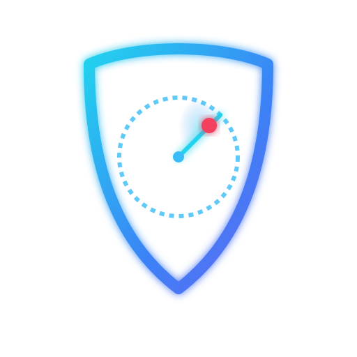

<p align="center">
  
</p>

<h1 align="center">Trawl</h1>

<p align="center">
  <strong>Find out what an attacker can see of your organisation — and get told the moment it changes.</strong>
</p>

<p align="center">
  <a href="#install">Install</a> ·
  <a href="#what-you-get">What you get</a> ·
  <a href="docs/distribution.md">All install options</a> ·
  <a href="docs/development.md">For developers</a> ·
  <a href="#licence">Licence</a>
</p>

---

Most organisations cannot answer a simple question: *which of our systems can
be reached from the internet right now?* The answer keeps changing. A marketing
team creates a new subdomain. A certificate expires. Someone widens a firewall
rule "temporarily". A repository is made public with a key still in its
history. None of this shows up in a vulnerability report, because nobody knew
to point the scanner at it.

Trawl finds those assets the way an attacker would — from the outside, with no
credentials and no agents — checks them without breaking them, and tells you
when something that used to be fine stops being fine.

It runs entirely on your own machine or your own server. There is no account to
create, no data leaves your infrastructure, and it is free.

## What you get

**A live inventory of your external footprint.** Trawl starts from open
sources — certificate transparency logs, DNS, ASN and WHOIS pivots — and then
confirms what it finds, which does mean connecting to hosts: reading a
certificate requires a TLS handshake with the server presenting it.

Contact is not the thing to avoid. Uncontrolled contact is. Every connection
Trawl makes is deliberate — a specific check, against a specific host, for a
stated reason, recorded in the scan history. It is also ordinary traffic: the
same kind of connection any internet user could make to a service you have
chosen to publish. Discovery leans on open sources first so the volume of
contact stays proportionate to what is being established, and the fuller
checks wait until you have confirmed an asset is yours. Once it is confirmed,
connecting to your own systems is simply due diligence. You cannot get
assurance about a service you refuse to talk to.

**Findings that are ranked honestly.** A vulnerability is prioritised by
whether it is *actually being exploited in the wild* (CISA KEV), how likely
exploitation is (EPSS), and how exposed the asset is — not by a vendor's
severity label. The ranking is a fixed calculation, so two people looking at
the same finding always see the same number.

**Email spoofing protection, checked properly.** SPF, DKIM and DMARC, plus
BIMI, MTA-STS, TLS-RPT and CAA. This is how most organisations get impersonated
and it is usually misconfigured.

**Secrets found before someone else finds them.** Full git-history scanning of
your public repositories. A key deleted in yesterday's commit is still in the
history, and still works.

**Alerts when things get worse, not just when things are new.** This is the
part most tools miss. Trawl compares every check against the last one, so a TLS
downgrade, a weakened DMARC policy, a newly-opened port or a re-exposed secret
raises an alert — even though nothing is technically "new".

**Plain-English explanations.** An optional AI layer writes up what a finding
means and how to fix it. It is advisory only and never influences the priority
score. You can point it at a local model, or leave it switched off entirely.

> **What Trawl will not do.** Trawl does connect to hosts — reading a
> certificate or checking a service means talking to it, and port and service
> checks are part of understanding your own attack surface. This is ordinary
> traffic of the kind any internet user could send to a service you have
> published. What Trawl will not do is attack: no exploitation, no credential
> brute-forcing, nothing capable of knocking a service over. The broader
> checks wait until you have approved the asset. And it looks from the outside
> only, so it complements internal vulnerability management rather than
> replacing it. It is not a log platform.

## Install

Two ways to run Trawl. They use the same engine.

### Desktop application

Best for individuals and small teams. No server, no Docker, no configuration —
it keeps its data in a single file under `~/.trawl/`.

**macOS**

```sh
brew install --cask adedayo/tap/trawl
```

**Windows**

```powershell
winget install Adedayo.Trawl
```

**Linux**

```sh
sudo apt install ./trawl_*_amd64.deb      # Debian, Ubuntu
sudo dnf install ./trawl-*.x86_64.rpm     # Fedora, RHEL
```

Or download directly from the
[latest release](https://github.com/adedayo/trawl/releases/latest) — macOS
builds are universal, and Linux has an AppImage if you would rather not
install anything.

> **macOS will warn you the first time.** Trawl is free software and is not
> signed with a paid Apple Developer certificate — we are not going to charge
> the community, however indirectly, to fund a $99/year rent to Apple. The
> Homebrew command above handles this for you and needs no workaround. If you
> download the `.dmg` directly, [docs/distribution.md](docs/distribution.md)
> explains what the warning actually means and gives you a one-line fix that
> applies to this app only.

### Self-hosted server

Best for continuous, scheduled monitoring across a team. Runs the engine,
scheduler and dashboard in Docker.

```sh
git clone https://github.com/adedayo/trawl.git
cd trawl
./setup.sh
```

The guided setup asks for your domains, an optional AI provider and where to
send alerts, then starts everything and prints your dashboard URL.

Requires [Docker](https://docs.docker.com/get-docker/) with Compose v2. Full
options, including pre-built container images, are in
[docs/distribution.md](docs/distribution.md).

## Getting started

1. **Add your domains.** Trawl works outward from these.
2. **Review what it finds.** Discovered assets land in a queue. Approve the
   ones that are yours; the rest are never touched.
3. **Let it run.** Scheduled checks build up history, and history is what makes
   regression alerts possible. The first run tells you where you stand; the
   value compounds after that.
4. **Connect alerts.** Slack or any webhook. Alerts are deduplicated and
   routed by category, so it stays quiet until it matters.

## Verifying what you downloaded

Every release publishes a `SHA256SUMS` file, a signature you can check without
any key of ours, and a full software bill of materials. A tool asking for
visibility of your attack surface should be able to prove what it shipped.
Instructions are in [docs/distribution.md](docs/distribution.md#verifying-a-download).

## Getting help

- **Something broken, or a feature you need?**
  [Open an issue](https://github.com/adedayo/trawl/issues).
- **Installation questions** — [docs/distribution.md](docs/distribution.md).
- **Want to contribute or understand the internals** —
  [docs/development.md](docs/development.md).

## Licence

Trawl is released under the [Apache License 2.0](LICENSE). You can use it
commercially, modify it, and run it in production without asking anyone.

Every dependency — engine, desktop app, dashboard and the Docker deployment —
is under an OSI-approved open-source licence, including
[vantage](https://github.com/adedayo/vantage) (BSD-3-Clause), which provides
the DNS, email and delegation assessment. See [NOTICE](NOTICE) for the full
list.
